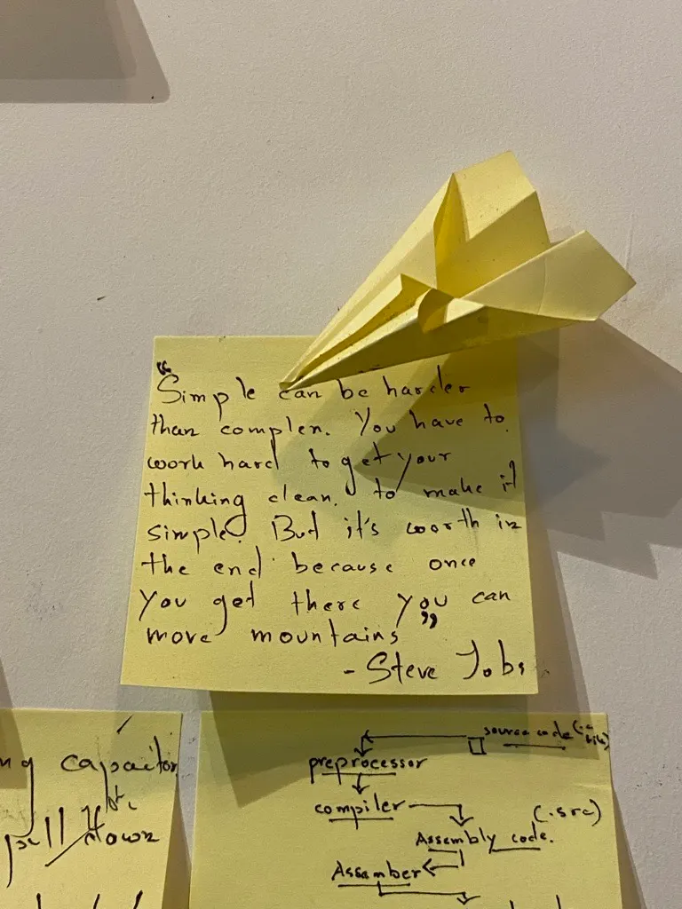
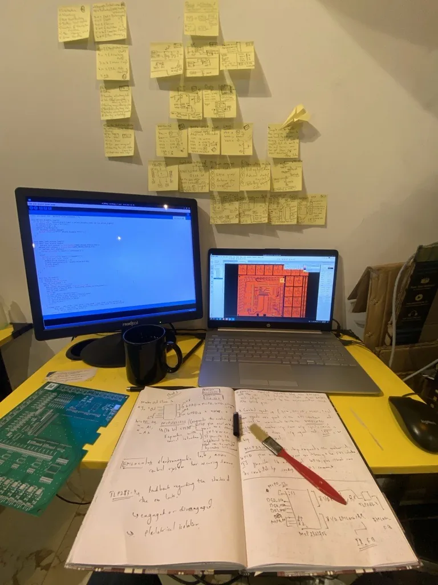
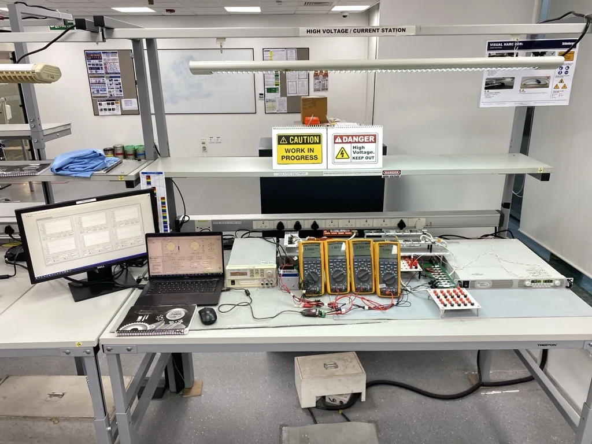
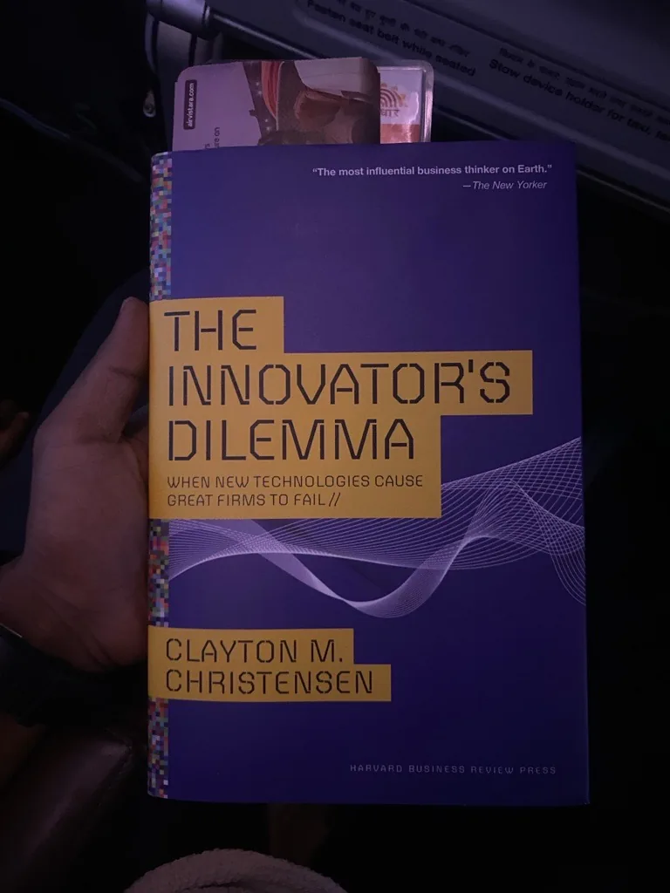
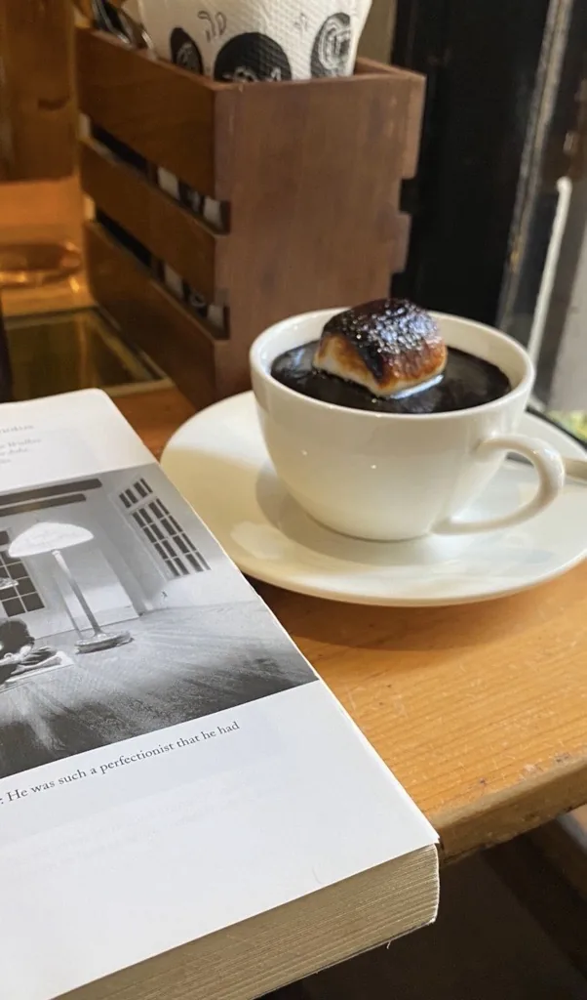

# Electrons and a frame

I'm Pushpal Das. I build products where electronics meets people — currently Principal PM in the CTO's office at Ixana.

*The roles, dates and credentials live on the experience page. This one is about how I see.*

---

## Curiosity came first

As a child I wanted to know how each person builds a whole reality out of their own thoughts. I reasoned my way around that question for years and kept arriving back where I started.

A camera helped. Through a lens I could borrow someone else's way of seeing, one frame at a time. I wanted to be a cinematographer.

What I kept was the lens. It turned out you can point it at circuits, and at people.

*a paper plane, over a note I kept*

## Learning what to build

In college I fell for electronics — the plain fact of electrons moving, and what a person can make them do. I went looking for someone who loved this from the other side, the artistic side, and found Steve Jobs. One thing from his story stayed: he trusted his read of what people would want before they could say it. I recognised that instinct. I have run on it since — across ideas, design, business, and people.

Then came the years with boards on a bench. Troubleshooting, the patience of finding out why a thing does not work, the first product that was mine end to end: what it should do, why, and whether it was good enough to ship.

*a desk, a bare board, and the wall it was worked out on*

> I liked building. I love deciding what gets built, and why.

## How I work

Hardware, embedded systems, semiconductors, AI — and today, wearable silicon and the Internet of Bodies at Ixana.

The work is deciding what matters and what can wait, holding the line between engineering and the business, and staying with a product until it ships. I own efficiency, our AI programs, products, and patents.

*a test bench, mid-measurement*

## What I keep going back to

Christensen's *The Innovator's Dilemma* explains why careful companies, doing everything right for their best customers, still get overtaken. I think about it whenever a roadmap starts to feel safe. Grove's *Only the Paranoid Survive* named something I had already met: a strategic inflection point arrives quietly, and the 10X force behind it does not announce itself. A venture of mine that went nowhere taught me the rest — not everyone is paying that kind of attention, and the ones who do are worth building with. Miller's *Chip War* is the third, a reminder that in deep tech the thing you are building is also the thing countries are counting.

*the Christensen, read in transit*

## The other lens

I still photograph. The year I graduated I trained under Asit Poddar, an artist from Satyajit Ray's cinematography team. Ray taught me how to see: a small, ordinary detail carries more than a speech.

So I got the cinematographer's life sideways. The lens is mine. The frame holds people and problems instead of film.

*an open book, a cup, a table*

## If any of this resonates

I want to keep building things that solve problems that actually matter, with people who care how it's done.

If you're working on something in that direction, write to me — I'd like to hear about it.

[pushpaldas2001@gmail.com](mailto:pushpaldas2001@gmail.com) / [LinkedIn](https://www.linkedin.com/in/pushpaldas/)
